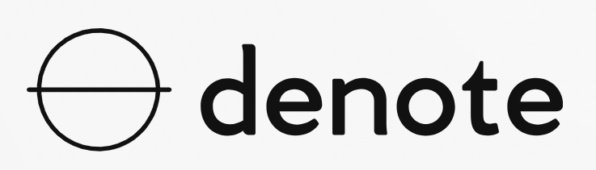

# Denote

We are aiming to provide transparency and traceability for AI datasets, as mandated by the [EU AI act](https://digital-strategy.ec.europa.eu/en/policies/regulatory-framework-ai) and proposed by Microsoft in their [Datasheets for datasets paper](https://arxiv.org/pdf/1803.09010.pdf).

This project is built on the [Internet Computer](https://internetcomputer.org/) blockchainn with [Motoko](https://internetcomputer.org/docs/current/motoko/main/motoko/) and [Svelte](https://svelte.dev/).

